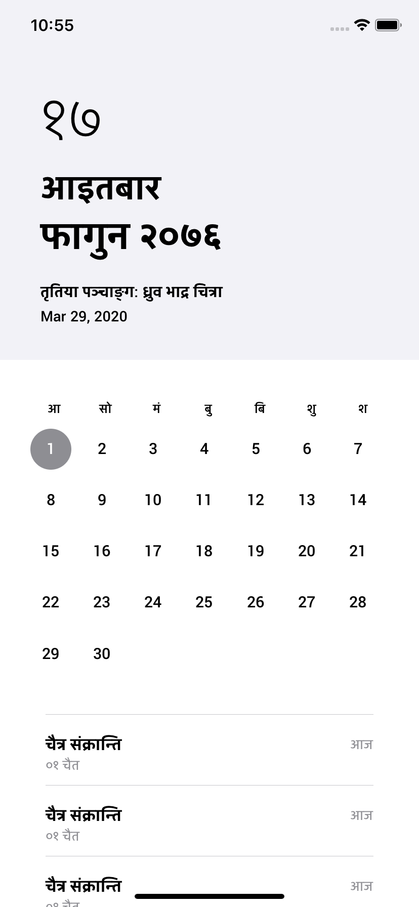
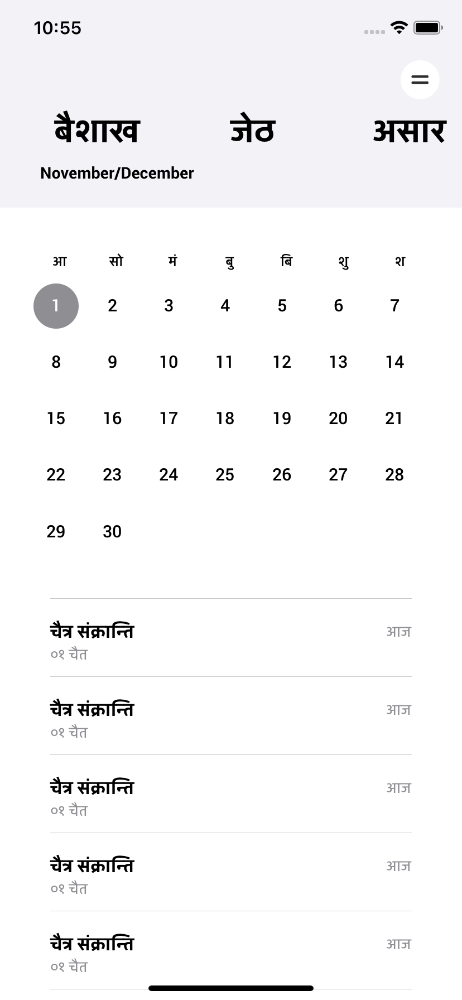
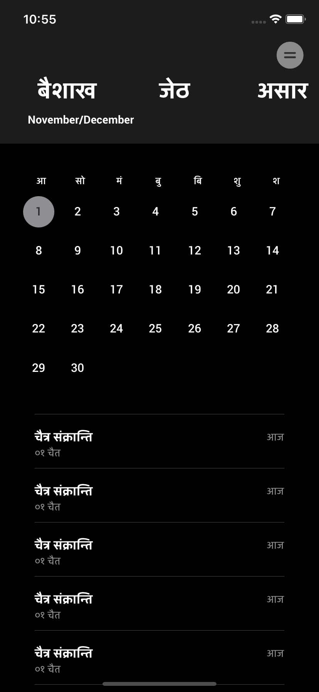
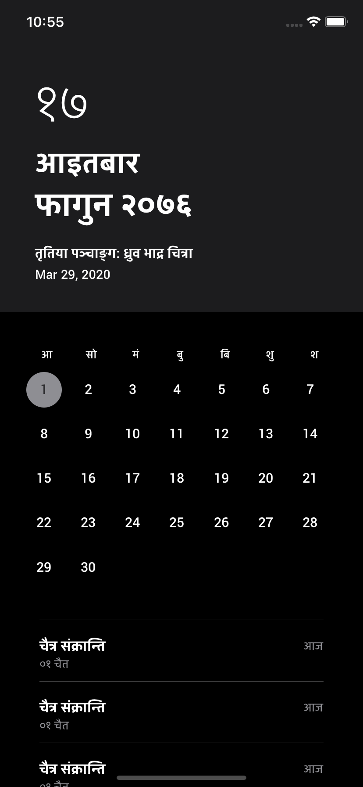

##  About Nepali Calendar

This application is an utility app which helps the user to know about the current Nepali date and Gregorian date. Most of the apps which are present in the AppStore do help to achieve the needed. The sole 
reason for this app's existence is the bloat free philosophy. A calendar does not need to have recent News,WeatherDetails and many other things. A calendar should be in our philosophy a neat piece of app
which can provide the deisred information without and hassle.

## Developement Flow
    - Built Using AutoLayout(Programmatic)
    - Uses iOS 13 SDK.

## Screen Shots
    - 
    - 
    - 
    - 

## Developers
    - Ravi Bastola (bastola.ravi@hotmail.com)
    

## UI/UX Design
    - Sangam Bhandari 

